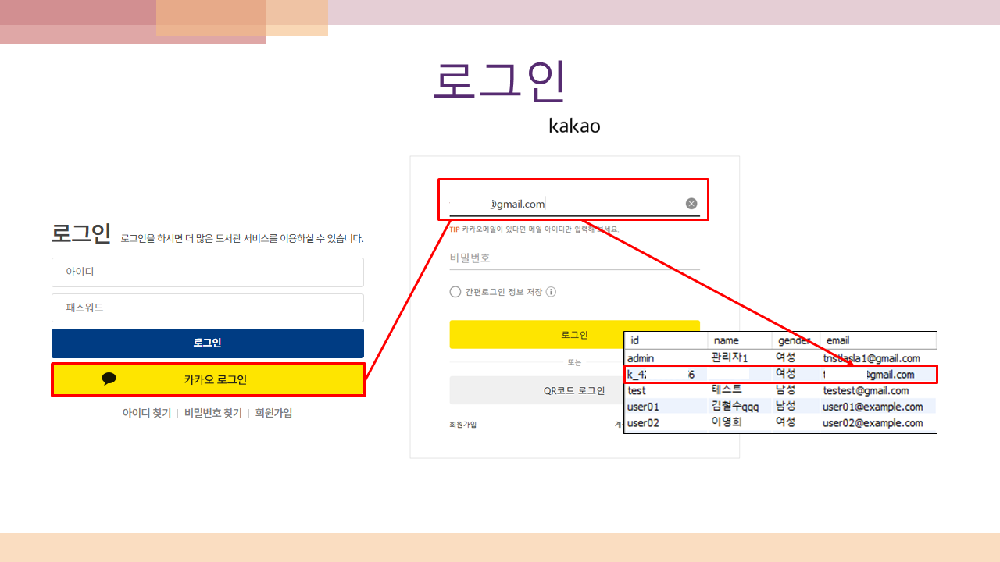
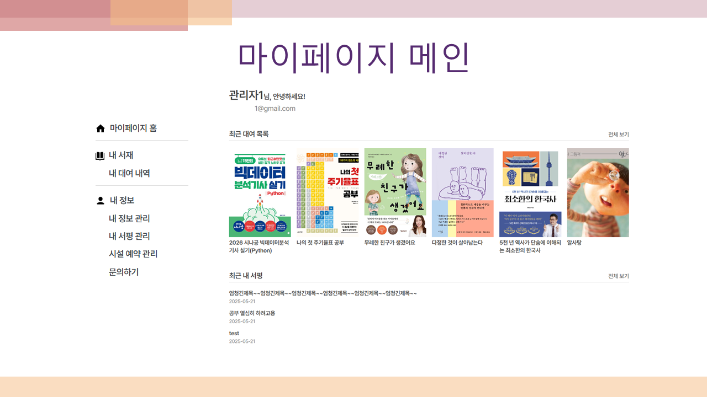
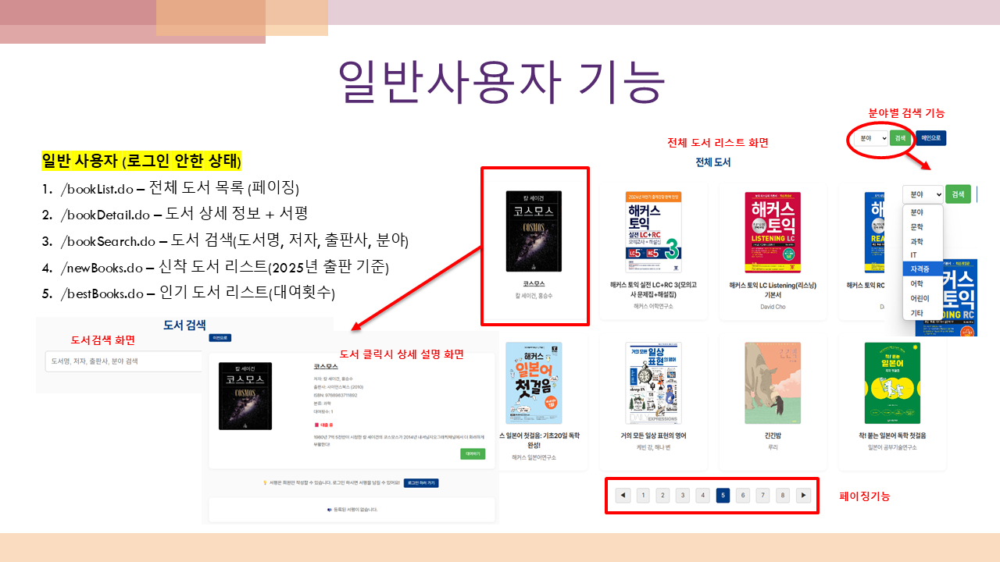
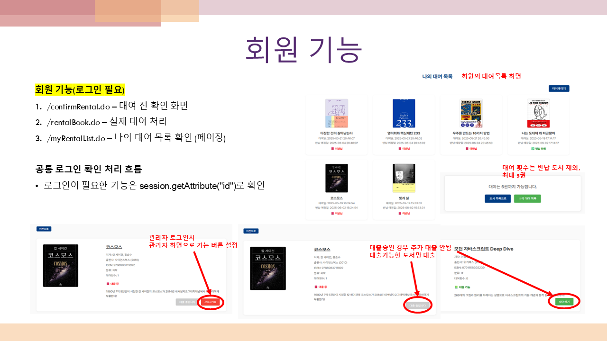
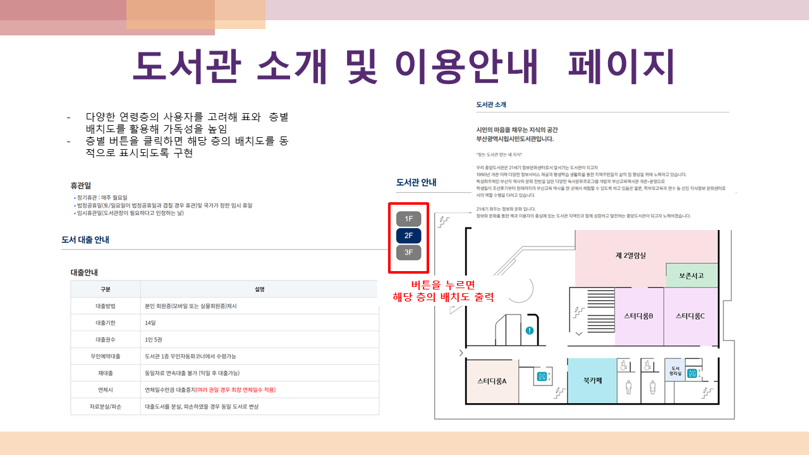
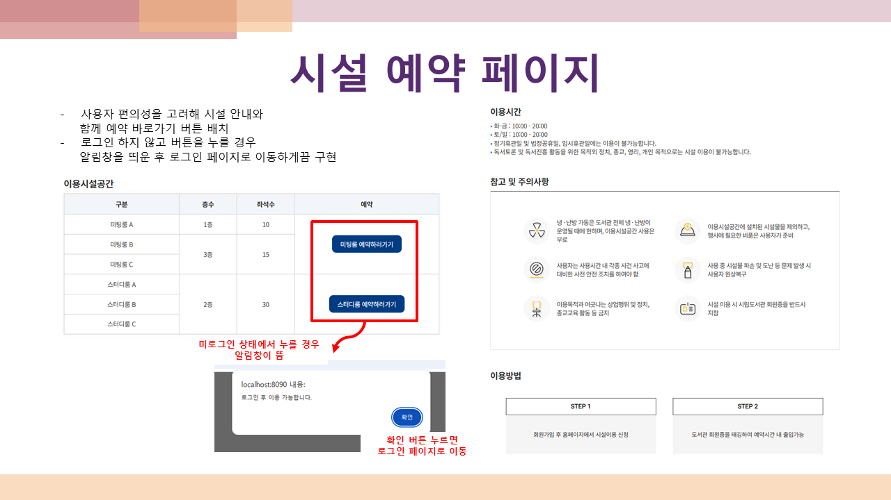
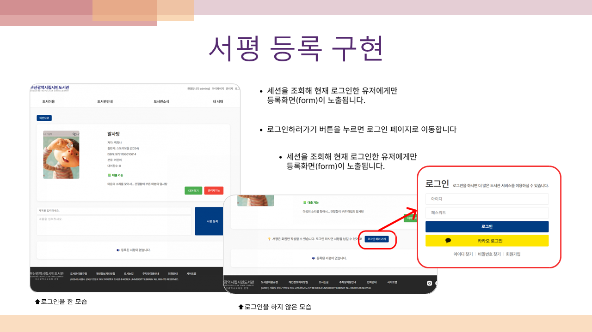
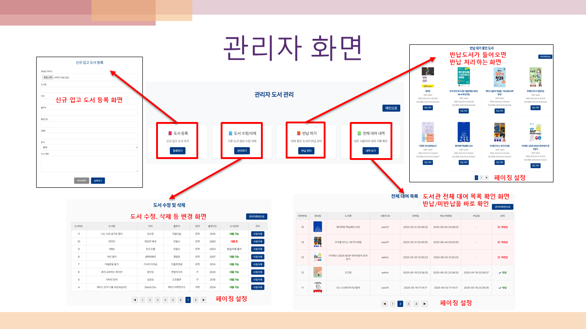

# 📚 도서관 관리 시스템 / Library Management System（図書館管理システム）

팀 프로젝트로 진행한 도서관 관리 시스템입니다.  
チームプロジェクトとして開発した図書館管理システムです。  
회원 기능, 도서 대여 및 반납, 시설 예약, 게시판 등 다양한 기능을 구현했습니다。  
会員機能、図書の貸出・返却、施設予約、掲示板などを実装しました。

---

## 🔧 개발 환경 / 開発環境

- **개발 기간 / 開発期間**  
  2025.04.23 ~ 2025.05.23 (약 1개월)  
  2025年4月23日 ～ 2025年5月23日（約1ヶ月）

- **개발 도구 / 開発ツール**  
  - Eclipse (Java 개발 IDE) / Eclipse（Java開発用IDE）  
  - MySQL Workbench (DB 설계 및 관리) / MySQL Workbench（データベース設計および管理）  
  - Git (버전 관리) / Git（バージョン管理）

- **서버 및 언어 / サーバーおよび使用言語**  
  - JDK 10.0.2  
  - Apache Tomcat 9.0  
  - MySQL Server  
  - HTML5, CSS3, JavaScript, jQuery  
  - Java (Servlet 기반), JSP, AJAX  
    Java（Servletベース）、JSP、AJAX

---

## 👨‍💻 팀원 및 역할 / チームメンバーと担当

- **이지원 / LEE JIWON**  
  - 회원가입, 로그인, 마이페이지 등 회원 기능 담당  
  - 会員登録、ログイン、マイページなどの会員機能を担当

- **한현주 / HAN HYUNJU**  
  - 도서 대여·반납 및 관리자 기능 구현  
  - 貸出・返却および管理者機能を担当

- **강혜미 / KANG HYEMI**  
  - 시설 이용 안내, 예약 및 배치도 구현  
  - 施設案内、予約、フロアマップなどを担当

- **윤지원 / YOON JIWON**  
  - 공지사항, 서평, 문의게시판 등 게시판 기능  
  - お知らせ、レビュー、問い合わせ掲示板などを担当

---

## 📁 주요 기능 / 主な機能

### 👤 회원 기능 / 会員機能
- 회원가입, 로그인/로그아웃  
  会員登録、ログイン/ログアウト  
- 카카오 로그인 API 연동  
  KakaoログインAPI連携  
- 비밀번호 및 아이디 찾기  
  パスワード・ID検索  
- 마이페이지, 내 정보 수정, 회원 탈퇴  
  マイページ、会員情報の修正、退会  
- 관리자용 회원 목록 및 삭제 기능  
  管理者による会員管理機能

### 📚 도서 대여 기능 / 図書貸出機能
- 전체 도서 목록, 상세 정보, 검색  
  全図書リスト、詳細情報、検索  
- 신착 도서 / 인기 도서 보기  
  新着図書 / 人気図書の表示  
- 도서 대여 및 반납 처리 (회원 전용)  
  貸出・返却処理（会員専用）  
- 관리자 도서 등록/수정/삭제  
  管理者による図書の登録・修正・削除

### 🏢 시설 예약 기능 / 施設予約機能
- 층별 배치도 및 이용 안내  
  フロアごとの案内と施設情報  
- 카카오맵 API를 통한 위치 안내  
  KakaoマップAPIでの位置表示  
- 미팅룸/스터디룸 예약, 시간제한, 상태별 표시  
  会議室・自習室予約、時間制限、状態表示  
- 관리자 시설 예약 관리 및 메모 기능  
  管理者による予約管理・メモ機能

### 📝 게시판 기능 / 掲示板機能
- 공지사항 / 서평 등록 및 조회  
  お知らせ / レビューの投稿・閲覧  
- 문의 게시판 및 파일 첨부 기능  
  問い合わせ掲示板およびファイル添付機能  
- 운영자 전용 글쓰기/수정 권한  
  管理者による投稿・修正機能

---

## 🗂️ DB 구조 / データベース構成

- 회원 테이블 (`member`) / 会員テーブル  
- 도서 테이블 (`book`) / 図書テーブル  
- 대여 테이블 (`rental`) / 貸出テーブル  
- 시설예약 테이블 (`reservation`) / 施設予約テーブル  
- 게시판 테이블 (`board`, `review`, `notice`, `inquiry`) / 掲示板関連テーブル

---

## 🖼️ 주요 화면 예시 / 主な画面イメージ

### 👤 로그인 및 마이페이지 / ログイン・マイページ

  

---

### 📚 도서 목록 및 상세 / 図書一覧・詳細画面

  

---

### 🏢 시설 이용안내 및 예약 / 施設案内・予約画面

  

---

### 📝 서평 게시판 / レビューボード

---

### 📘 관리자 도서 등록 / 管理者の書籍登録画面

---

## ✨ 팀 소감 / チームメンバーの感想

> **한현주 / HAN HYUNJU**  
> JSP와 Servlet 연동, MVC2 패턴 설계를 직접 구현하며 사용자 흐름을 고민할 수 있었습니다.  
> JSPとServletの連携、MVC2設計を通じて、ユーザーの流れを考える良い経験になりました。  

> **이지원 / LEE JIWON**  
> 다양한 API를 적용하고 싶은 욕심이 생겼습니다. 다음엔 더 치밀하게 설계하고 싶습니다.  
> もっと多様なAPIを活用したいと思いました。次はもっと緻密な設計を目指します。  

> **윤지원 / YOON JIWON**  
> 처음은 막막했지만 하나하나 구현하며 자신감을 얻었습니다.  
> 最初は不安でしたが、一つずつ実装しながら自信がつきました。  

> **강혜미 / KANG HYEMI**  
> 다양한 오류를 해결하며 개발의 재미와 성취감을 느낄 수 있었습니다.  
> 多くのエラーを解決しながら、開発の楽しさと達成感を感じました。

---

## 📌 기타 / その他

- 로그인 확인 및 관리자 권한 분기는 세션 사용  
  ログインと管理者認証はセッションで判定  
- 전체 리스트 및 검색 결과에 페이징 처리 적용  
  一覧表示・検索結果にページネーションを適用  
- 날짜, 상태, 예약 조건에 따른 동적 필터링 구현  
  日付・状態・予約条件に応じた動的なフィルタリングを実装

---

## 🖥️ 실행 방법 / 実行方法（로컬 전용 / ローカルのみ）

1. MySQL에서 DB 생성 후 SQL 스크립트 실행  
   MySQLにてデータベース作成後、初期スクリプトを実行
2. Eclipse에서 톰캣 설정 및 WAR 실행  
   EclipseでTomcat設定およびWARファイルを実行
3. `localhost:포트번호/프로젝트명` 으로 접속
   `http://localhost:8090/LibraryProject`  
   `localhost:ポート番号/プロジェクト名` にアクセス
   `http://localhost:8090/LibraryProject`

---

## 📞 문의 / お問い合わせ

> 한현주 / HAN HYUNJU  
> mira2539@gmail.com
